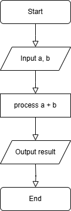
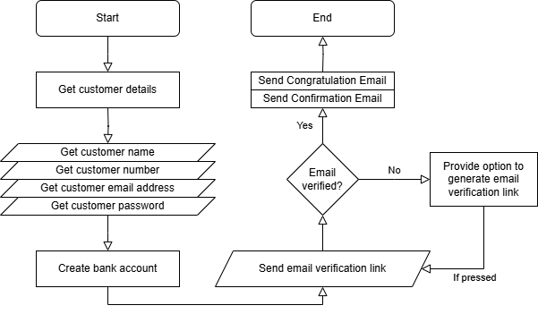

# PHP

## Overview of IT  

### Programming Languages 

Types of Programming languages
- Procedural oriented
- object-oriented 
- Logical
- Functional

### Internet

- WWW is known as a world wide web is a collection of websites and webpage stored on web servers and are connected to local computers through the internet.
- These websites contain text pages, digital images, audio, videos, etc.  
- Users can access the content of these sites from any part of the world.

#### Types of Internet

1. Digital subscriber line (DSL)
2. Cable internet
3. Fiber optic
4. Satelite internet
5. Wireless
6. Broadband over Power lines (BPL)

### Internet protocols

- A network protocol is a group of rules accompanied by the network. 
- Network protocols are formalized requirements and plans consisting rules, procedures and types that describe and manage communication among devices over the network.

#### Examples of internet protocols
1. HTTP (Hyper Text Transfer Protocol) or HTTPS
2. FTP (file transfer protocol)
3. Email protocols (POP3, SMTP)
4. TCP (Transmission control protocol) and UDP (User Datagram Protocol)

### Software Application

- Software is a set of logical instructions that tells a device what to do, how to do and when to do it.
- Software consists programs, procedures and routines that allow a device to perform various functions.

#### Types of Software

- Application Software
- System Software
- Driver Software
- Middleware
- Programming Software

### Application Security

- Application security refers to security precaution used at the application level to prevent theft or hijacking of data or code within the application.  
- It includes security concerns made during application development and design, as well as methods and procedures for protecting applications once they have been deployed.
- All tasks that introduce a secure software development life cycle to development teams are included in application security shortly known as AppSec.
- Its ultimate purpose is to improve security practices and as a result detect, repair and ideally avoid security flaws in applications.
- It cover the entire application life cycle including requirement analysis, design implementation, testing and maintenance.

### SDLC

1. Planning
2. Requirement Analysis
3. Desigining
4. Implementation
5. Testing
6. Maintenance

### Software Architecture

Software architecture is the blueprint of building software. It shows the overall structure of the software, the collection of components in it and how they interact with one another while hiding the implementation.

1. **Presentation Layer** - This layer is also called the UI layer and handles the interaction that user have with the software. It is the most visible layer and defines the application's overall look and presentation to the end-users.

2. **Application Layer** - This layer handles the main program of the architecture. It includes the code definitions and most basic functions of the developed application. This is the layer that programmer spends most of their time when working on the software.

3. **Business Layer** - This layer is also called the domain layer where the application's business logic operates. Business logic is a collection of rules that tell the system how to run an application based on the organization's guidelines. This layer determines the behaviour of the entire application and its flow.

4. **Persistance Layer** - This layer is also called the data access layer and acts as a protective layer. It contains the codes that is necessary to access the database layer.

5. **Database Layer** - This is the layer where system stores all the data. It is the lowest tier in the software architecture and houses not only data but indexes and tables as well. All operations on data happens in this layer while keeping the procedures hidden.

### Flow Chart

- create a flow chart for addition of two number.

### Flash assignment

- create flow chart for creating a bank account.

