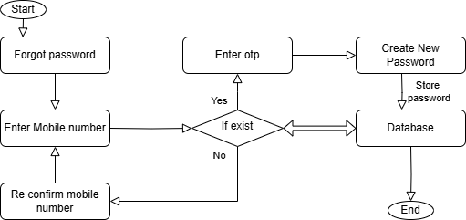
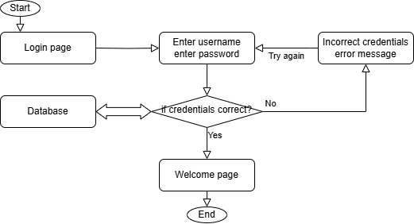

# PHP

## Overview of IT  

### Programming Languages 

Types of Programming languages
- Procedural oriented
- object-oriented 
- Logical
- Functional

### Internet

- WWW is known as a world wide web is a collection of websites and webpage stored on web servers and are connected to local computers through the internet.
- These websites contain text pages, digital images, audio, videos, etc.  
- Users can access the content of these sites from any part of the world.

#### Types of Internet

1. Digital subscriber line (DSL)
2. Cable internet
3. Fiber optic
4. Satelite internet
5. Wireless
6. Broadband over Power lines (BPL)

### Internet protocols

- A network protocol is a group of rules accompanied by the network. 
- Network protocols are formalized requirements and plans consisting rules, procedures and types that describe and manage communication among devices over the network.

#### Examples of internet protocols
1. HTTP (Hyper Text Transfer Protocol) or HTTPS
2. FTP (file transfer protocol)
3. Email protocols (POP3, SMTP)
4. TCP (Transmission control protocol) and UDP (User Datagram Protocol)

### Software Application

- Software is a set of logical instructions that tells a device what to do, how to do and when to do it.
- Software consists programs, procedures and routines that allow a device to perform various functions.

#### Types of Software

- Application Software
- System Software
- Driver Software
- Middleware
- Programming Software

### Application Security

- Application security refers to security precaution used at the application level to prevent theft or hijacking of data or code within the application.  
- It includes security concerns made during application development and design, as well as methods and procedures for protecting applications once they have been deployed.
- All tasks that introduce a secure software development life cycle to development teams are included in application security shortly known as AppSec.
- Its ultimate purpose is to improve security practices and as a result detect, repair and ideally avoid security flaws in applications.
- It cover the entire application life cycle including requirement analysis, design implementation, testing and maintenance.

### SDLC

1. Planning
2. Requirement Analysis
3. Desigining
4. Implementation
5. Testing
6. Maintenance

### Software Architecture

Software architecture is the blueprint of building software. It shows the overall structure of the software, the collection of components in it and how they interact with one another while hiding the implementation.

1. **Presentation Layer** - This layer is also called the UI layer and handles the interaction that user have with the software. It is the most visible layer and defines the application's overall look and presentation to the end-users.

2. **Application Layer** - This layer handles the main program of the architecture. It includes the code definitions and most basic functions of the developed application. This is the layer that programmer spends most of their time when working on the software.

3. **Business Layer** - This layer is also called the domain layer where the application's business logic operates. Business logic is a collection of rules that tell the system how to run an application based on the organization's guidelines. This layer determines the behaviour of the entire application and its flow.

4. **Persistance Layer** - This layer is also called the data access layer and acts as a protective layer. It contains the codes that is necessary to access the database layer.

5. **Database Layer** - This is the layer where system stores all the data. It is the lowest tier in the software architecture and houses not only data but indexes and tables as well. All operations on data happens in this layer while keeping the procedures hidden.

### Flow Chart

- create a flow chart for addition of two number.


### Flash assignment

- create flow chart for creating a bank account.


- create flow chart for forget password



- create flow chart for login page




## What is api?

An **API (Application Programming Interface)** is a set of rules, protocols, and tools that allow different software applications to communicate and interact with each other. It acts as an intermediary, enabling one system to access the features or data of another system without needing to understand its internal workings.

### Key Concepts:
1. **Interface**: The API defines how the requesting software (client) and the responding software (server) interact.  
2. **Abstraction**: It hides the complexity of the underlying implementation, providing a simple way to use its functionality.  
3. **Communication**: APIs enable communication between systems, even if they are built on different technologies.

### Types of APIs:
1. **Web APIs**:
   - Allow applications to interact over the internet.
   - Commonly use protocols like HTTP or HTTPS.
   - Examples: REST, SOAP, GraphQL.
2. **Operating System APIs**:
   - Enable applications to interact with the operating system.
   - Example: Windows API, POSIX.
3. **Library APIs**:
   - Provide predefined functions or classes that developers can use in their programs.
   - Example: Standard libraries in programming languages like Python or Java.
4. **Hardware APIs**:
   - Allow software to interact with hardware components.
   - Example: GPU APIs for rendering graphics.

### Common Use Cases:
1. **Data Access**: Fetch data from a remote server (e.g., weather, stock prices).  
   Example: A weather app using an API to retrieve weather information.  
2. **Third-Party Integration**: Connect to external services.  
   Example: Payment gateways like PayPal or Stripe.  
3. **Automation**: Automate repetitive tasks between applications.  
   Example: Using APIs to sync calendar events across apps.  

### Example of a Web API Request:
A simple API request to a weather service might look like this:  
```plaintext
GET https://api.weather.com/v1/current?city=Ahmedabad&key=yourapikey
```

### Benefits of APIs:
1. **Efficiency**: Reuse existing functionality instead of building from scratch.
2. **Interoperability**: Enables systems with different technologies to work together.
3. **Scalability**: Easy to extend functionality by integrating more APIs.
4. **Innovation**: Encourages building new applications by leveraging existing services.

APIs are foundational to modern software development, enabling the seamless integration of diverse systems and services.

## User case diagram

add product - seller  
purchase product - buyer  
 view product - buyer - seller  
login - buyer - seller  
signup - buyer - seller  

## History of C language

created by denis ritchee as the system programming language - 1970
launched a popular book called C programming langauge and so got a new name. 1979

value, variable, datatype

datatype
int %d  
float %f  
string %s  
double %lf  
longdouble %Lf  
boolean
char %c

#### c

file extension for c file `.c`

      #include<stdio.h>
      main(){
         
      }
 
`#` -> predefine  
include -> add something  
stdio -> standard input output  
`.h` -> header file  

### Static calculator

      #include<stdio.h>
      main(){
         //printf
         int a=50, b=10;

         printf("A : %d", a);
         printf("\nB : %d", b);
         printf("\n Add : %d", a+b);
         printf("\n Sub : %d", a-b);
         printf("\n Mul : %d", a*b);
         printf("\n Div : %d", a/b);
         printf("\n Div : %.2f", (float)a/b); //typecasting
      }

### Dynamic calculator

      #include<stdio.h>
      main(){
         int a,b;
         
         printf("Enter value 1 : ");
         scanf("%d", &a);
         printf("Enter value 2 : ");
         scanf("%d", &b);

         printf("A : %d", a);
         printf("\nB : %d", b);
         printf("\n Add : %d", a+b);
         printf("\n Sub : %d", a-b);
         printf("\n Mul : %d", a*b);
         printf("\n Div : %d", a/b);
         printf("\n Div : %.2f", (float)a/b); //typecasting
      }

## Convert years to days

      #include<stdio.h>
      main(){
         // years to days
         int year;
         printf("Enter year : ");
         scanf("%d", &year);
            
         int days = year * 365;
         printf("Days are : %d", days);
      }

## Switch variables with temporary variable

      #include<stdio.h>
      main(){
         // switch variables with temporary variable
            int a,b,temp;
            printf("Enter value 1 : ");
            scanf("%d", &a);
            printf("Enter value 2 : ");
            scanf("%d", &b);
            
            temp = a;
            a = b;
            b = temp;
            
            printf("\nvalue a : %d", a);
            printf("\nvalue b : %d", b);
      }

## Switch variables without temporary variable

      #include<stdio.h>
      main(){
         // switch variables without temporary variable
            int a,b,temp;
            printf("Enter value 1 : ");
            scanf("%d", &a);
            printf("Enter value 2 : ");
            scanf("%d", &b);
            
            a = a+b;
            b = a-b;
            a = a-b;

            printf("\nvalue a : %d", a);
            printf("\nvalue b : %d", b);
      }

## days to year

      #include<stdio.h>
      main(){
         // days to year
            int days, temp; 
            float year;
            printf("Enter number of days : ");
            scanf("%d", &days);

            year =(float)days/365;
            temp = days % 365;
            
            printf("Total number of years %d and days %d", (int)year, temp);
      }

## year to month

      #include<stdio.h>
      main(){
      // year to month
            int month, year;
            printf("Enter value for year : ");
            scanf("%d", &year);
            
            month = year*12;
            
            printf("Value for months : %d", month);
      }

## Month to year

      #include<stdio.h>
      main(){
         // month to year 
            int month;
            printf("Enter value for month : ");
            scanf("%d", &month);
            float year;
            
            year=(float)month/12;
            
            printf("Value for years : %f", year);
      }

## 