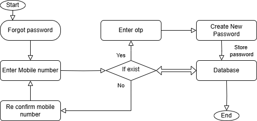

# PHP

## Overview of IT  

### Programming Languages 

Types of Programming languages
- Procedural oriented
- object-oriented 
- Logical
- Functional

### Internet

- WWW is known as a world wide web is a collection of websites and webpage stored on web servers and are connected to local computers through the internet.
- These websites contain text pages, digital images, audio, videos, etc.  
- Users can access the content of these sites from any part of the world.

#### Types of Internet

1. Digital subscriber line (DSL)
2. Cable internet
3. Fiber optic
4. Satelite internet
5. Wireless
6. Broadband over Power lines (BPL)

### Internet protocols

- A network protocol is a group of rules accompanied by the network. 
- Network protocols are formalized requirements and plans consisting rules, procedures and types that describe and manage communication among devices over the network.

#### Examples of internet protocols
1. HTTP (Hyper Text Transfer Protocol) or HTTPS
2. FTP (file transfer protocol)
3. Email protocols (POP3, SMTP)
4. TCP (Transmission control protocol) and UDP (User Datagram Protocol)

### Software Application

- Software is a set of logical instructions that tells a device what to do, how to do and when to do it.
- Software consists programs, procedures and routines that allow a device to perform various functions.

#### Types of Software

- Application Software
- System Software
- Driver Software
- Middleware
- Programming Software

### Application Security

- Application security refers to security precaution used at the application level to prevent theft or hijacking of data or code within the application.  
- It includes security concerns made during application development and design, as well as methods and procedures for protecting applications once they have been deployed.
- All tasks that introduce a secure software development life cycle to development teams are included in application security shortly known as AppSec.
- Its ultimate purpose is to improve security practices and as a result detect, repair and ideally avoid security flaws in applications.
- It cover the entire application life cycle including requirement analysis, design implementation, testing and maintenance.

### SDLC

1. Planning
2. Requirement Analysis
3. Desigining
4. Implementation
5. Testing
6. Maintenance

### Software Architecture

Software architecture is the blueprint of building software. It shows the overall structure of the software, the collection of components in it and how they interact with one another while hiding the implementation.

1. **Presentation Layer** - This layer is also called the UI layer and handles the interaction that user have with the software. It is the most visible layer and defines the application's overall look and presentation to the end-users.

2. **Application Layer** - This layer handles the main program of the architecture. It includes the code definitions and most basic functions of the developed application. This is the layer that programmer spends most of their time when working on the software.

3. **Business Layer** - This layer is also called the domain layer where the application's business logic operates. Business logic is a collection of rules that tell the system how to run an application based on the organization's guidelines. This layer determines the behaviour of the entire application and its flow.

4. **Persistance Layer** - This layer is also called the data access layer and acts as a protective layer. It contains the codes that is necessary to access the database layer.

5. **Database Layer** - This is the layer where system stores all the data. It is the lowest tier in the software architecture and houses not only data but indexes and tables as well. All operations on data happens in this layer while keeping the procedures hidden.

### Flow Chart

- create a flow chart for addition of two number.


### Flash assignment

- create flow chart for creating a bank account.


- create flow chart for forget password



- create flow chart for login page


## What is api?

An **API (Application Programming Interface)** is a set of rules, protocols, and tools that allow different software applications to communicate and interact with each other. It acts as an intermediary, enabling one system to access the features or data of another system without needing to understand its internal workings.

### Key Concepts:
1. **Interface**: The API defines how the requesting software (client) and the responding software (server) interact.  
2. **Abstraction**: It hides the complexity of the underlying implementation, providing a simple way to use its functionality.  
3. **Communication**: APIs enable communication between systems, even if they are built on different technologies.

### Types of APIs:
1. **Web APIs**:
   - Allow applications to interact over the internet.
   - Commonly use protocols like HTTP or HTTPS.
   - Examples: REST, SOAP, GraphQL.
2. **Operating System APIs**:
   - Enable applications to interact with the operating system.
   - Example: Windows API, POSIX.
3. **Library APIs**:
   - Provide predefined functions or classes that developers can use in their programs.
   - Example: Standard libraries in programming languages like Python or Java.
4. **Hardware APIs**:
   - Allow software to interact with hardware components.
   - Example: GPU APIs for rendering graphics.

### Common Use Cases:
1. **Data Access**: Fetch data from a remote server (e.g., weather, stock prices).  
   Example: A weather app using an API to retrieve weather information.  
2. **Third-Party Integration**: Connect to external services.  
   Example: Payment gateways like PayPal or Stripe.  
3. **Automation**: Automate repetitive tasks between applications.  
   Example: Using APIs to sync calendar events across apps.  

### Example of a Web API Request:
A simple API request to a weather service might look like this:  
```plaintext
GET https://api.weather.com/v1/current?city=Ahmedabad&key=yourapikey
```

### Benefits of APIs:
1. **Efficiency**: Reuse existing functionality instead of building from scratch.
2. **Interoperability**: Enables systems with different technologies to work together.
3. **Scalability**: Easy to extend functionality by integrating more APIs.
4. **Innovation**: Encourages building new applications by leveraging existing services.

APIs are foundational to modern software development, enabling the seamless integration of diverse systems and services.

## User case diagram 

add product - seller  
purchase product - buyer  
 view product - buyer - seller  
login - buyer - seller  
signup - buyer - seller  

# Introduction to C language

created by denis ritchee as the system programming language - 1970
launched a popular book called C programming langauge and so got a new name. 1979

value, variable, datatype

datatype
int %d  
float %f  
string %s  
double %lf  
longdouble %Lf  
boolean
char %c

### Examples

file extension for c file `.c`

      #include<stdio.h>
      main(){
         
      }
 
`#` -> predefine  
include -> add something  
stdio -> standard input output  
`.h` -> header file  

### Static calculator

      #include<stdio.h>
      main()
      {
         // static calculator

         int a = 55, b = 10;

         printf("A : %d", a);
         printf("\nB : %d", b);
         printf("\n Add : %d", a + b);
         printf("\n Sub : %d", a - b);
         printf("\n Mul : %d", a * b);
         printf("\n Div : %d", a / b);
         printf("\n Div : %.2f", (float)a / b); // typecasting
      }

### Dynamic input calculation

      #include<stdio.h>

      main() {
         // Dynamic input calculation
         int a, b;

         printf("Enter value 1 : ");
         scanf("%d", & a);
         printf("Enter value 2 : ");
         scanf("%d", & b);

         printf("A : %d", a);
         printf("\nB : %d", b);
         printf("\n Add : %d", a + b);
         printf("\n Sub : %d", a - b);
         printf("\n Mul : %d", a * b);
         printf("\n Div : %d", a / b);
         printf("\n Div : %.2f", (float) a / b); //typecasting
      }

### Convert number of years into number of days

      #include<stdio.h>

      main() {
         // Convert number of years into number of days
         int year;
         printf("Enter year : ");
         scanf("%d", & year);

         int days = year * 365;
         printf("Days are : %d", days);
      }

### Switch variables with temporary variable

      #include<stdio.h>

      main() {
         // switch variable with temporary variable
         int a, b, temp;
         printf("Enter value a : ");
         scanf("%d", & a);
         printf("Enter value b : ");
         scanf("%d", & b);

         temp = a;
         a = b;
         b = temp;

         printf("\nvalue a : %d", a);
         printf("\nvalue b : %d", b);
      }

### Switch variables without temporary variable

      #include<stdio.h>

      main() {
         // switch variables without temporary variable
         int a, b, temp;
         printf("Enter value a : ");
         scanf("%d", & a);
         printf("Enter value b : ");
         scanf("%d", & b);

         a = a + b;
         b = a - b;
         a = a - b;

         printf("\nvalue a : %d", a);
         printf("\nvalue b : %d", b);
      }

### Convert number of days into number of year/s

      #include<stdio.h>

      main() {

         // Convert number of days into number of year/s

         int days, temp;
         float year;

         printf("Enter number of days : ");
         scanf("%d", & days);

         year = (float) days / 365;
         temp = days % 365;

         printf("Total number of years %d and days %d", (int) year, temp);
      }

### Convert number of years into number of months

      #include<stdio.h>

      main() {
         // Convert number of years into number of months
         int month, year;
         printf("Enter value for year : ");
         scanf("%d", & year);

         month = year * 12;

         printf("Value for months : %d", month);
      }

### Convert number of months into number of years

      #include<stdio.h>

      main() {
         // Convert number of months into number of years
         int month;
         printf("Enter value for month : ");
         scanf("%d", & month);
         float year;
         year = (float) month / 12;
         printf("Value for years : %f", year);
      }

## Conditional Statements
There are 3 types of conditional statements  
1. Normal if...else statement  
2. Ladder if...else statement  
3. Nested if...else statement

### Example for Normal if...else statements

      #include <stdio.h>

      main() {
         // Check age eligibility for voting
         int n;
         printf("Enter age : ");
         scanf("%d", & n);
         if (n >= 18) {
            printf("Eligible for vote!!");
         } else {
            printf("Not eligible for vote!!");
         }
      }

### Examples for Ladder if...else statements

      #include <stdio.h>

      main() {
         // Check age eligibility for voting with invalid age check
         int n;
         printf("Enter age : ");
         scanf("%d", & n);
         if (n > 100) {
            printf("Invalid age!!");
         } else if (n >= 18) {
            printf("Eligible for vote!!");
         } else {
            printf("Not eligible for vote!!");
         }
      }

### Check if a number is even or odd

      #include<stdio.h>

      main() {
         // Check if a number is even or odd
         int n;
         printf("Enter a number : ");
         scanf("%d", & n);
         if (n == 0) {
            printf("Neither even nor odd!!");
         } else if (n % 2 == 0) {
            printf("%d is even number!!", n);
         } else {
            printf("%d is odd number!!", n);
         }
      }

### Check if a number is greater than another number

      #include<stdio.h>

      main() {
         // Check if a number is greater than another number
         int n, m;
         printf("Enter number A: ");
         scanf("%d", & n);

         printf("Enter number B: ");
         scanf("%d", & m);

         printf("A = %d", n);
         printf("\nB = %d", m);

         if (n > m) {
            printf("\nNumber A is greater than number B");
         } else {
            printf("\nNumber A is not greater than number B");
         }
      }

### Examples for nested if...else statements

      #include<stdio.h>

      main() {
         // Check which of the three numbers is greatest
         int n1, n2, n3;
         printf("Enter number n1: ");
         scanf("%d", & n1);
         printf("Enter number n2: ");
         scanf("%d", & n2);
         printf("Enter number n3: ");
         scanf("%d", & n3);

         if (n1 > n2) {
            if (n1 > n3) {
                  printf("\nn1 is greatest");
            } else {
                  printf("\nn3 is greatest");
            }
         } else {
            if (n2 > n3) {
                  printf("\nn2 is greatest");
            } else {
                  printf("\nn3 is greatest");
            }
         }
      }

### Check which of the three numbers is greatest using logical operators

      #include <stdio.h>

      main() {
         // Check which of the three numbers is greatest
         int n1, n2, n3;
         printf("Enter number n1: ");
         scanf("%d", & n1);
         printf("Enter number n2: ");
         scanf("%d", & n2);
         printf("Enter number n3: ");
         scanf("%d", & n3);

         if (n1 > n2 && n1 > n3) {
            printf("\n%d is greatest", n1);
         } else if (n2 > n1 && n2 > n3) {
            printf("\n%d is greatest", n2);
         } else {
            printf("\n%d is greatest", n3);
         }
      }

## Looping

Loop repeats a particular statement or a code block till the condition remains satisfied.

There are 2 types of loops
1. Entry control loops : e.g., `while`, `for`
2. Exit control loops : e.g., `do...while`

Examples:
### Print number from 10 to 1
```c
#include <stdio.h>

main() {
    // Declare variables
    int a;
    
    // Print number from 10 to 1
    // while loop
    a=10;
    while(a>=1){
    	printf("%d ", a);
    	a--;
    	printf("\n");
	}
	
}
```
---
### Print number in decending order from the number entered by user
```c
#include <stdio.h>

main() {
    // Print number in decending order from the number entered 
    // by user
    int a;
    
    printf("Please enter a number : ");
    scanf("%d", &a);
    
    // Print number from 10 to 1
    // while loop
	//    a=10;
    while(a>=1){
    	printf("%d ", a);
    	a--;
    	printf("\n");
	}
}
```
---
### Print factorial number from the number entered by user (while loop)
```c
#include <stdio.h>

main() {
    // Print factorial number from the number entered by user
    int a;
    int i=1,fac=1;
    printf("Please enter a number : ");
    scanf("%d", &a);
    while(i<=a){
    	fac=fac*i;
    	i++;
	}
	printf("Factorial number of %d is %d", a, fac);
}
```
---
### Print summation value for number provided by user (while loop)
```c
#include <stdio.h>

main() {
    // Print summation of numbers from the number to 1. Number provided by user
    int a;
    int i=1,sum=0;
    printf("Please enter a number : ");
    scanf("%d", &a);
    while(i<=a){
    	sum=sum+i; //0+1=1, 1+2=3, 3+3=6, 6+4=10, 10+5=15
    	i++;
	}
	printf("Summation of numbers for %d is %d", a, sum);
}
```
---
###
```c

```
## List of functions present in stdio.h header file

The `stdio.h` header file in C provides functions for input and output operations. Below is a list of commonly used functions provided by this header:

### File Input/Output
- **`fopen`**: Opens a file.
- **`fclose`**: Closes an open file.
- **`fread`**: Reads data from a file.
- **`fwrite`**: Writes data to a file.
- **`fseek`**: Sets the file position to a specified offset.
- **`ftell`**: Returns the current file position.
- **`rewind`**: Sets the file position to the beginning of the file.
- **`fflush`**: Flushes the output buffer of a file.
- **`fgetc`**: Reads a character from a file.
- **`fputc`**: Writes a character to a file.
- **`fgets`**: Reads a string from a file.
- **`fputs`**: Writes a string to a file.
- **`getc`**: Reads a character (similar to `fgetc` but can be used with macros).
- **`putc`**: Writes a character (similar to `fputc` but can be used with macros).
- **`ungetc`**: Pushes a character back to the file stream.

### Standard Input/Output
- **`printf`**: Prints formatted output to the standard output.
- **`fprintf`**: Prints formatted output to a file.
- **`sprintf`**: Prints formatted output to a string.
- **`snprintf`**: Prints formatted output to a string with a size limit.
- **`scanf`**: Reads formatted input from the standard input.
- **`fscanf`**: Reads formatted input from a file.
- **`sscanf`**: Reads formatted input from a string.

### Character Input/Output
- **`getchar`**: Reads a character from standard input.
- **`putchar`**: Writes a character to standard output.

### Error Handling
- **`perror`**: Prints a description of the last error.
- **`clearerr`**: Clears the error and end-of-file indicators for a file stream.
- **`feof`**: Checks the end-of-file indicator for a file stream.
- **`ferror`**: Checks the error indicator for a file stream.

### File Buffering
- **`setbuf`**: Sets the buffer for a file.
- **`setvbuf`**: Sets the mode of buffering for a file.

### Temporary File and Name Handling
- **`tmpfile`**: Creates a temporary file.
- **`tmpnam`**: Generates a unique temporary file name.

### Other Utility Functions
- **`remove`**: Deletes a file.
- **`rename`**: Renames a file.

These functions cover a wide range of functionality for file handling and standard input/output operations in C.

## List of functions present in string.h header file

The `string.h` header file in C provides functions for manipulating and handling null-terminated strings and memory blocks. Here's a list of the functions commonly found in `string.h`:

### String Manipulation Functions
- **`strcpy`**: Copies one string to another.
- **`strncpy`**: Copies a specified number of characters from one string to another.
- **`strcat`**: Appends one string to the end of another.
- **`strncat`**: Appends a specified number of characters from one string to the end of another.

### String Comparison Functions
- **`strcmp`**: Compares two strings lexicographically.
- **`strncmp`**: Compares a specified number of characters from two strings.
- **`strcoll`**: Compares two strings using the current locale.
- **`strcasecmp`**: Compares two strings case-insensitively (non-standard, but common in some implementations).

### String Search and Tokenization Functions
- **`strchr`**: Finds the first occurrence of a character in a string.
- **`strrchr`**: Finds the last occurrence of a character in a string.
- **`strstr`**: Finds the first occurrence of a substring in a string.
- **`strtok`**: Tokenizes a string (splits it into tokens based on delimiters).
- **`strpbrk`**: Finds the first occurrence of any character from one string in another string.
- **`strspn`**: Gets the length of the initial segment of a string containing only specified characters.
- **`strcspn`**: Gets the length of the initial segment of a string containing none of the specified characters.

### String Length and Duplication Functions
- **`strlen`**: Calculates the length of a string.
- **`strdup`**: Duplicates a string (non-standard, but commonly available).

### String Conversion Functions
- **`strerror`**: Returns a pointer to a string describing an error code.

### Memory Manipulation Functions
- **`memcpy`**: Copies a block of memory from one location to another.
- **`memmove`**: Copies a block of memory, allowing for overlapping memory areas.
- **`memset`**: Sets a block of memory to a specified value.
- **`memcmp`**: Compares two blocks of memory.
- **`memchr`**: Finds the first occurrence of a character in a block of memory.

These functions provide a wide range of tools for working with strings and memory, essential for C programming.